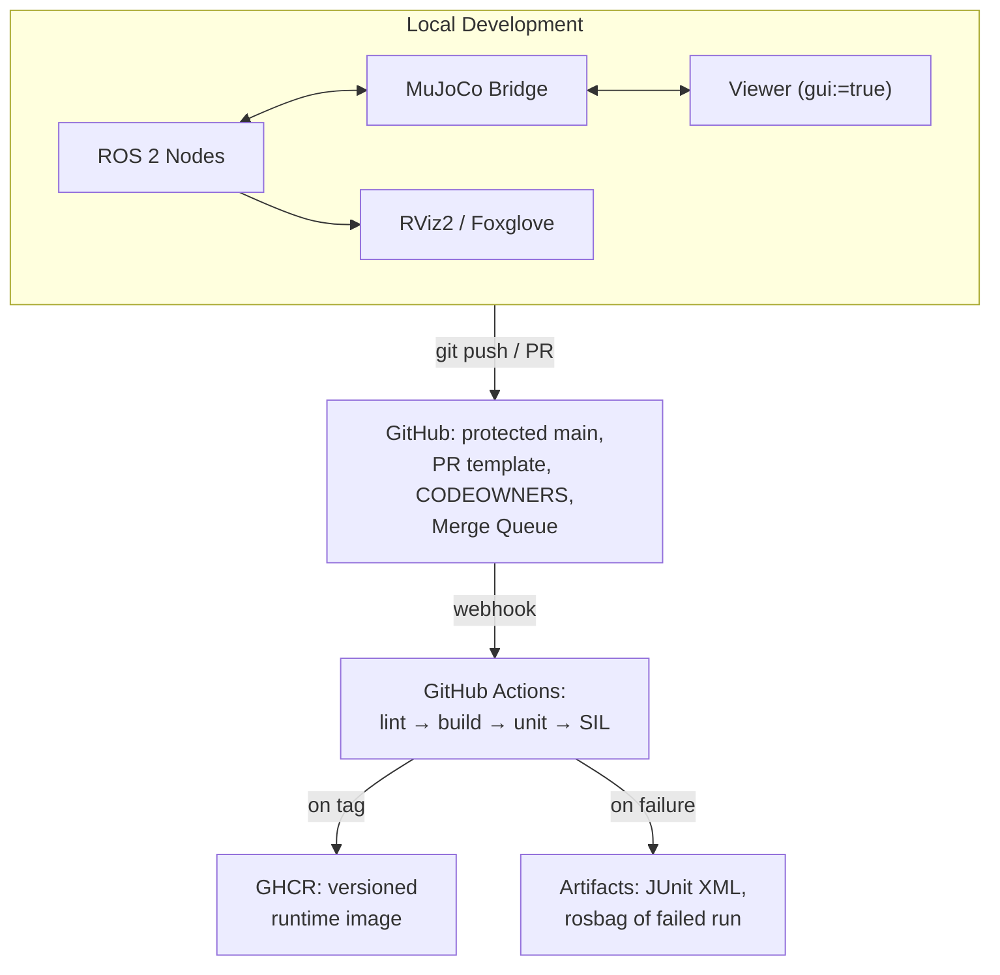
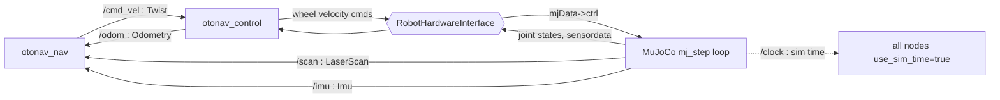
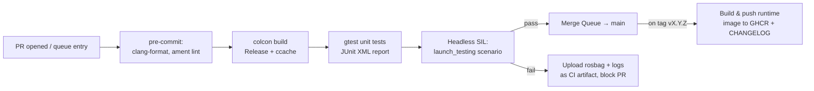

# Architecture: OtoNav-CI

End-to-end SIL platform: ROS 2 Humble + MuJoCo 3.3.x, validated by GitHub Actions CI with merge-queue-gated integration.

## 1. System Context



## 2. Package Layout

```
otonav_project/
├── otonav_description    # MJCF model, meshes, sensor sites
├── otonav_mujoco_bridge  # C++ sim bridge (the HAL boundary lives here)
├── otonav_control        # diff-drive kinematics: /cmd_vel → wheel cmds, odom integration
├── otonav_nav            # go-to-goal P-controller, lidar stop-on-obstacle
└── otonav_bringup        # launch files, launch_testing SIL scenarios, configs
```

## 3. Node & Data Flow



## 4. Key Design Decisions (ADR-style)

### ADR-1: Headless via runtime flag, not compile-time ifdef
`mj_step` (physics) has zero OpenGL dependency. Rendering is only needed for the human viewer or camera sensors. Therefore one binary serves both environments: the launch arg `gui:=false` simply skips viewer construction. If offscreen camera rendering is ever needed in CI, set `MUJOCO_GL=egl` (or `osmesa`) — still no code change. Compile-time `#ifdef HEADLESS_MODE` would create two divergent binaries and violate "test what you ship."

### ADR-2: Sim time as the single clock
CI runners have unpredictable CPU contention; wall-clock timeouts cause flaky tests. The bridge publishes `/clock`; every node runs `use_sim_time:=true`; tests assert against sim-time budgets and use conditional waits (`spin_until_future_complete`, executors with predicates), never `sleep()`.

### ADR-3: DDS on CI — simplest thing first
GitHub runners block inter-host multicast but loopback works. Layered strategy:
1. `ROS_LOCALHOST_ONLY=1` + `RMW_IMPLEMENTATION=rmw_fastrtps_cpp` — usually sufficient.
2. Fallback (kept in `config/fastdds_ci_profile.xml`, documented): UDPv4 transport with `initialPeers = 127.0.0.1` and metatraffic unicast, disabling multicast discovery. Note: a SHM-only transport with builtin transports disabled breaks discovery — SHM carries data, discovery still needs UDP. SHM can be *added alongside* UDPv4 for intra-host throughput.

### ADR-4: HAL boundary instead of full ros2_control (time-boxed choice)
The sim-to-real story is told through an abstract interface:

```
class RobotHardwareInterface:
    write(wheel_velocity_cmds)   # actuation
    read() -> JointStates        # feedback

MujocoInterface : RobotHardwareInterface   # implemented
CanBusInterface : RobotHardwareInterface   # stub, demonstrates the swap
```

Control and nav code never touch MuJoCo types. Migrating to `ros2_control` + `mujoco_ros2_control` is the documented stretch path; the interface boundary is identical in spirit (hardware_interface plugin swap via config).

### ADR-5: Multi-stage Docker with correct entrypoint
Builder stage: full toolchain, MuJoCo SDK, `colcon build --merge-install`. Runner stage: `ros-core` + runtime libs + `COPY --from=builder` of `/ws/install` and MuJoCo runtime libs. Critical fix over naive designs: `setup.bash` cannot be an ENTRYPOINT (it is sourced, not executed). Correct pattern:

```
entrypoint.sh:  source /opt/ros/humble/setup.bash
                source /ws/install/setup.bash
                exec "$@"
```

ccache is mounted/cached in CI (`actions/cache`) to keep rebuild times in minutes.

### ADR-6: Merge Queue as the integration gate
Branch protection requires green CI + review. GitHub's native merge queue re-tests each PR against the *latest* main before merging, eliminating the "passed on my branch, broke on main" class of failures — the textbook integration-engineer problem, solved with platform tooling rather than process discipline alone.

## 5. CI Pipeline



SIL acceptance scenario: spawn robot headless → publish goal (3 m ahead, obstacle en route) → assert within 20 s *sim time*: obstacle never closer than 0.3 m AND goal reached within 0.1 m tolerance.

## 6. Kinematics Reference (diff drive)

Control input u = [v, ω]. Wheel angular velocities (r = wheel radius, L = track width):
- ω_L = (2v − ωL) / (2r)
- ω_R = (2v + ωL) / (2r)

Odometry integration (world frame): ẋ = v·cosθ, ẏ = v·sinθ, θ̇ = ω, integrated at the bridge step rate on sim time.

## 7. Interview Q&A Anchors

**"How do you guarantee sim-validated code behaves on real hardware?"**
Reality-gap mitigation: (1) HAL boundary — only the hardware interface implementation swaps (ADR-4), the entire stack above is identical; (2) injected Gaussian noise models on sensors and actuation latency in sim; (3) identical containerized runtime on both targets — the image tested in CI is the image deployed.

**"How do you fight flaky simulation tests in CI?"**
Sim time everywhere (ADR-2), conditional waits instead of sleeps, deterministic seeds in the physics scenario, localhost-only DDS to remove network nondeterminism (ADR-3), and rosbag-on-failure artifacts so a flake is debuggable instead of re-run-and-pray.

**"How do you handle large test data (rosbags) in CI?"**
Never in git. Reference bags live in versioned object storage (S3/GHCR artifacts); the pipeline pulls only what the scenario needs, runs, and cleans up. Git LFS only for small reference assets.

**"What does the merge queue buy you over plain required checks?"**
Required checks validate a PR against the main it branched from; the queue validates against the main it will actually land on, serially or in optimistic batches. It converts integration order into a tested property.
